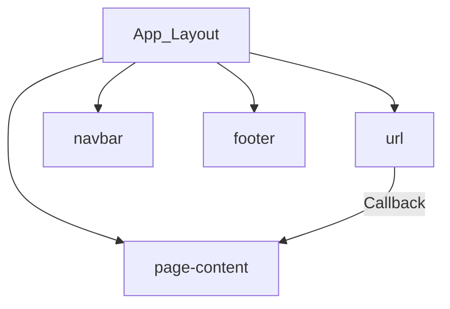
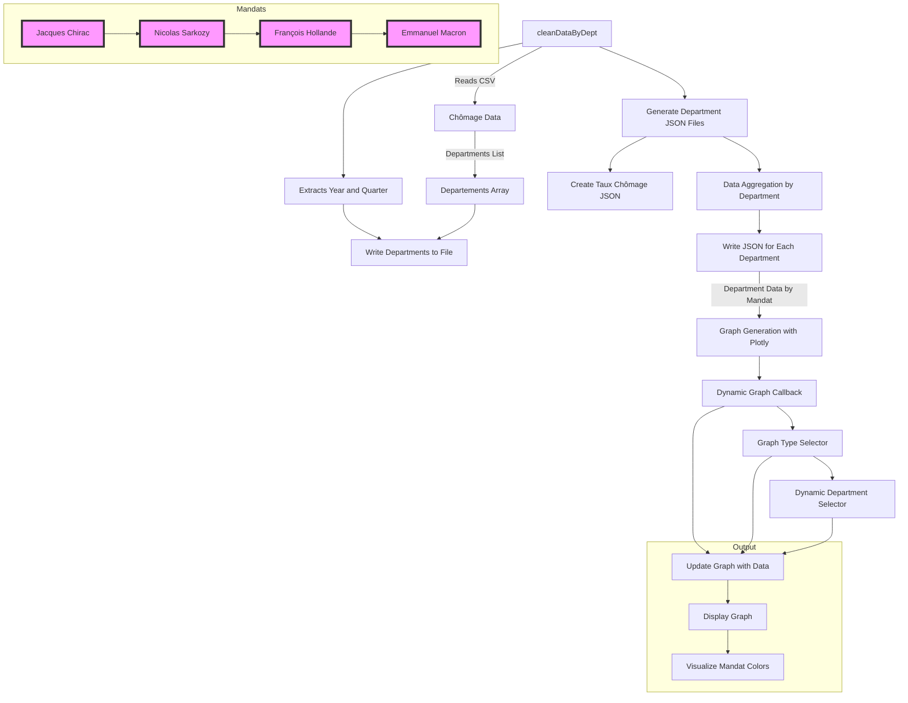
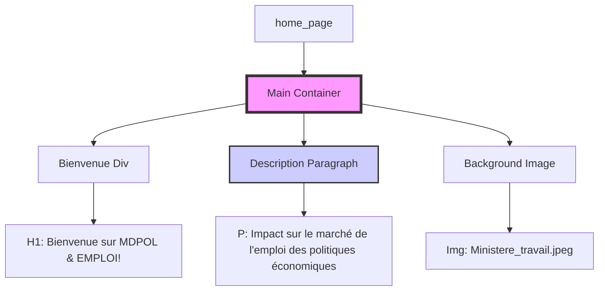
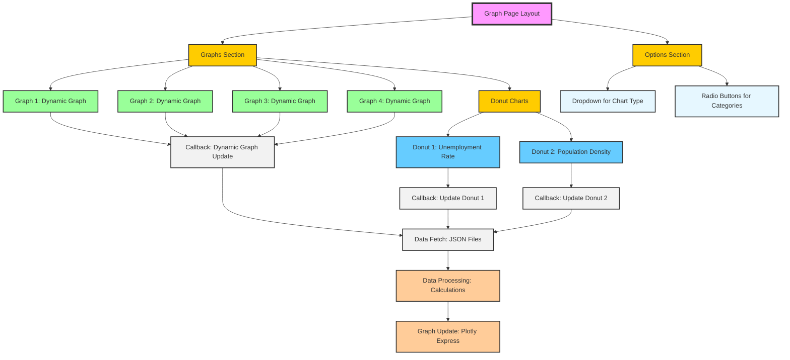
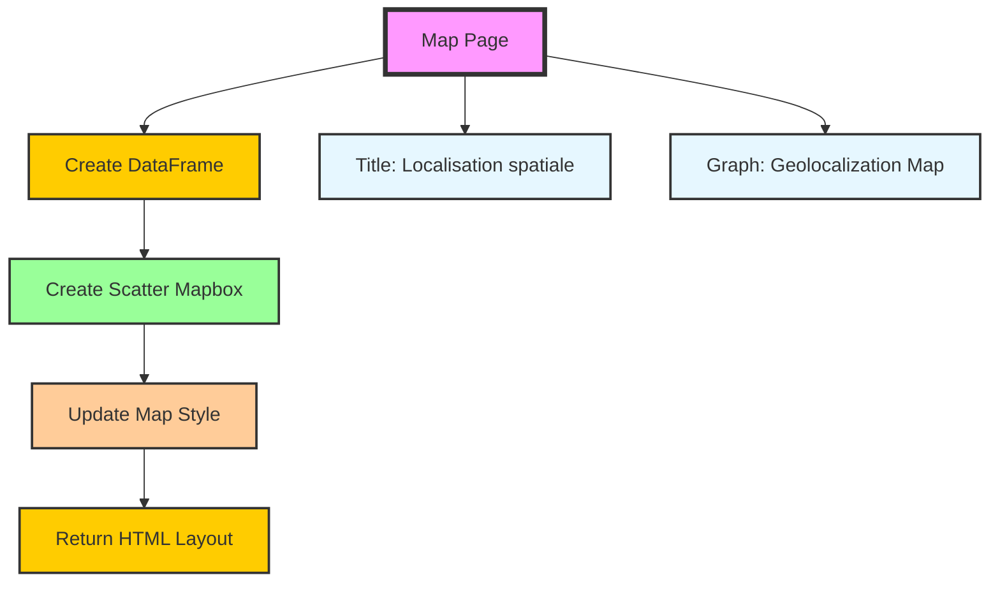
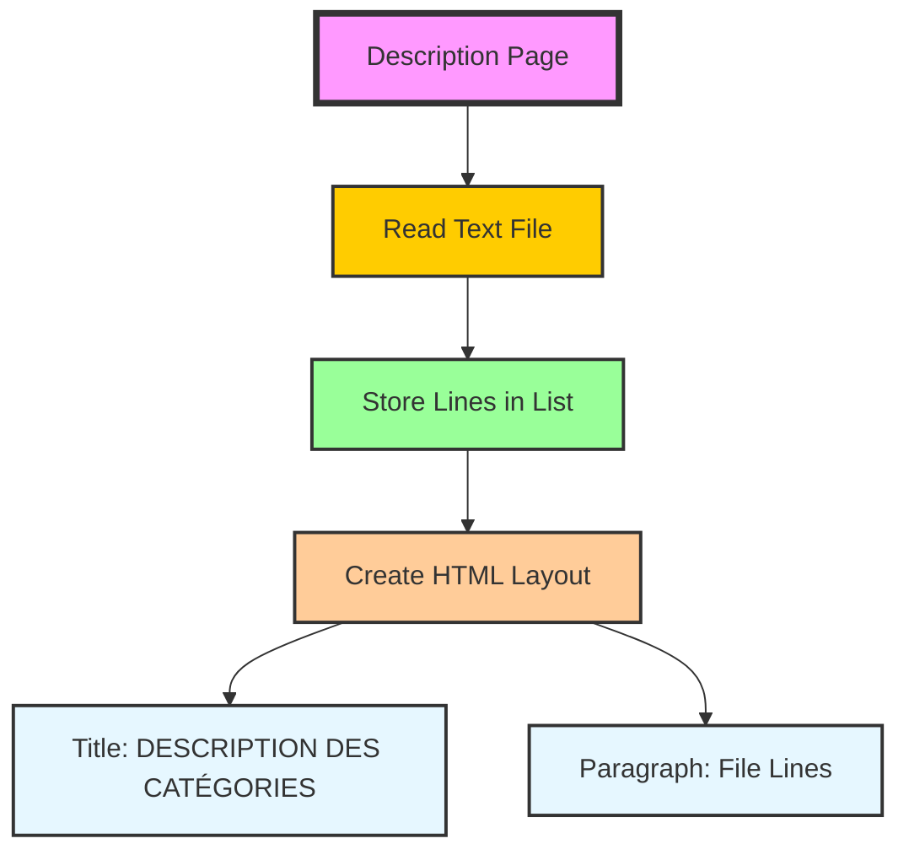
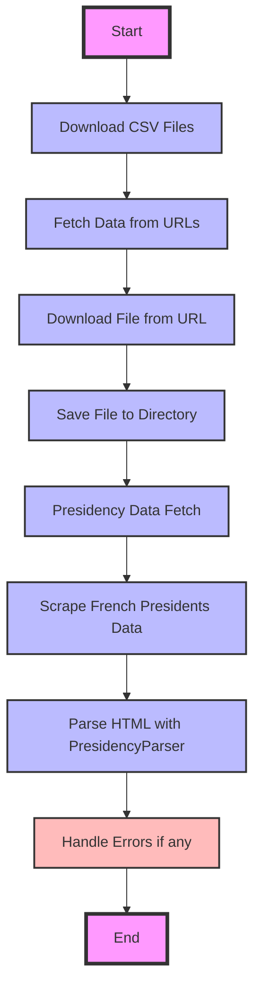
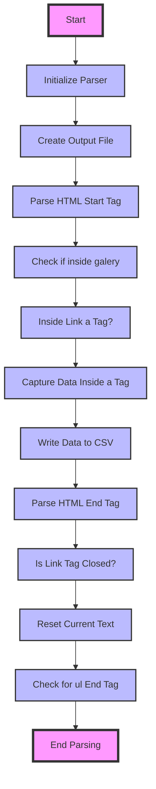
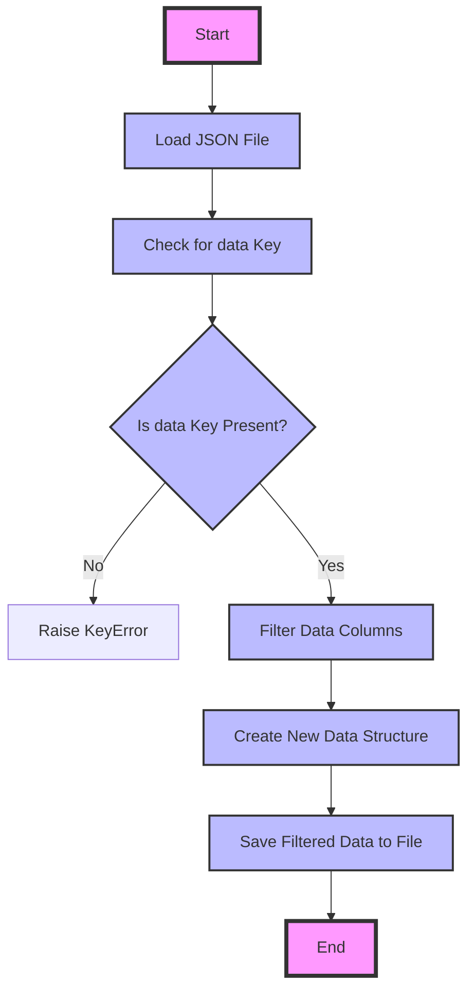
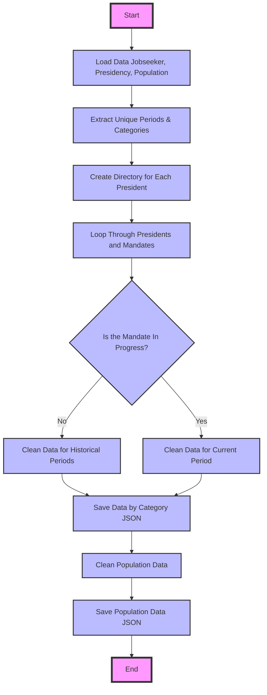

<b>Kokou et Ounissa </b>  

# Infos sur de projet Mdpol&Emploi
<b> Bienvenue sur la page de notre projet concernant une étude des taux de chômages et du nombre de demandeurs d'emploi en France en fonction du temps et des régions allignée sur les mandats présidentiels allant de Jacques Chirac à Emmanuel Marcon. </b>  

## User Guide

### installation des dépenddances 
`$ python -m pip install -r requirements.txt`
###  Premier lancement du projet
Si le repertoires  `data/cleaned` est vide alors assurez-vous de suprimer s'il existe, le fichier `data_already_downloaded.flag` avant le lancer le projet
### lancement du projet (`python>=3.0`)
`$ python main.py`

##  Data

`------fichier .csv -----`

- ### csv emploi 1996- 2023
    - [cliquez ici](https://public.opendatasoft.com/api/explore/v2.1/catalog/datasets/labouref-france-departement-quarter-jobseeker/exports/csv?lang=fr&timezone=Europe%2FBerlin&use_labels=true&delimiter=%3B)
- ### csv  geolocalisation
    - [cliquez ici](https://public.opendatasoft.com/api/explore/v2.1/catalog/datasets/correspondance-code-insee-code-postal/exports/csv?lang=fr&timezone=Europe%2FBerlin&use_labels=true&delimiter=%3B)
- ### csv emploi 2007-2012
    - [cliquez ici](https://public.opendatasoft.com/api/explore/v2.1/catalog/datasets/base-cc-caract-emploi-2012-arm/exports/csv?lang=fr&timezone=Europe%2FBerlin&use_labels=true&delimiter=%3B)
- ### csv  population
    - [cliquez ici](https://public.opendatasoft.com/api/explore/v2.1/catalog/datasets/demographyref-france-pop-legale-commune-arrondissement-municipal-millesime/exports/csv?lang=fr&timezone=Europe%2FBerlin&use_labels=true&delimiter=%3B)

`----- site  source ------`

### dataset geolocalisation départements 
[cliquez ici](https://public.opendatasoft.com/explore/dataset/correspondance-code-insee-code-postal/table/?location=3,18.5278,-2.98684&basemap=jawg.light)
    

### dataset emploi 2007-2012
[cliquez ici](https://public.opendatasoft.com/explore/dataset/base-cc-caract-emploi-2012-arm/information/?sort=actifs_occupes_15_ans_ou_plus_en_2007_princ&dataChart=eyJxdWVyaWVzIjpbeyJjb25maWciOnsiZGF0YXNldCI6ImJhc2UtY2MtY2FyYWN0LWVtcGxvaS0yMDEyLWFybSIsIm9wdGlvbnMiOnsic29ydCI6ImFjdGlmc19vY2N1cGVzXzE1X2Fuc19vdV9wbHVzX2VuXzIwMDdfcHJpbmMifX0sImNoYXJ0cyI6W3siYWxpZ25Nb250aCI6dHJ1ZSwidHlwZSI6ImNvbHVtbiIsImZ1bmMiOiJBVkciLCJ5QXhpcyI6ImNvZGVfZ2VvZ3JhcGhpcXVlIiwic2NpZW50aWZpY0Rpc3BsYXkiOnRydWUsImNvbG9yIjoiI0ZGNTE1QSJ9XSwieEF4aXMiOiJhbm5lZSIsIm1heHBvaW50cyI6NTAsInNvcnQiOiIifV0sInRpbWVzY2FsZSI6IiIsImRpc3BsYXlMZWdlbmQiOnRydWUsImFsaWduTW9udGgiOnRydWV9&location=3,18.54017,-3.01253&basemap=jawg.light)

### dataset emploi 1996- 2023
[cliquez ici](https://public.opendatasoft.com/explore/dataset/labouref-france-departement-quarter-jobseeker/export/?disjunctive.category&disjunctive.age_groups&disjunctive.reg_name&disjunctive.dep_area_code&disjunctive.dep_name&sort=date&refine.category=B&refine.category=C&dataChart=eyJxdWVyaWVzIjpbeyJjaGFydHMiOlt7InR5cGUiOiJjb2x1bW5yYW5nZSIsImZ1bmMiOiJDT1VOVCIsInlBeGlzIjoibmJfam9ic2Vla2VyIiwic2NpZW50aWZpY0Rpc3BsYXkiOnRydWUsImNvbG9yIjoicmFuZ2UtY3VzdG9tIiwiY2hhcnRzIjpbeyJmdW5jIjoiTUlOIiwieUF4aXMiOiJuYl9qb2JzZWVrZXIifSx7ImZ1bmMiOiJNQVgiLCJ5QXhpcyI6Im5iX2pvYnNlZWtlciJ9XX1dLCJ4QXhpcyI6ImRhdGUiLCJtYXhwb2ludHMiOiIiLCJ0aW1lc2NhbGUiOiJ5ZWFyIiwic29ydCI6IiIsInNlcmllc0JyZWFrZG93biI6ImNhdGVnb3J5IiwiY29uZmlnIjp7ImRhdGFzZXQiOiJsYWJvdXJlZi1mcmFuY2UtZGVwYXJ0ZW1lbnQtcXVhcnRlci1qb2JzZWVrZXIiLCJvcHRpb25zIjp7ImRpc2p1bmN0aXZlLmNhdGVnb3J5Ijp0cnVlLCJkaXNqdW5jdGl2ZS5hZ2VfZ3JvdXBzIjp0cnVlLCJkaXNqdW5jdGl2ZS5yZWdfbmFtZSI6dHJ1ZSwiZGlzanVuY3RpdmUuZGVwX2FyZWFfY29kZSI6dHJ1ZSwiZGlzanVuY3RpdmUuZGVwX25hbWUiOnRydWUsInNvcnQiOiJkYXRlIiwicmVmaW5lLmNhdGVnb3J5IjpbIkIiLCJDIl19fX1dLCJkaXNwbGF5TGVnZW5kIjp0cnVlLCJhbGlnbk1vbnRoIjp0cnVlLCJ0aW1lc2NhbGUiOiIifQ%3D%3D)  

### dataset relatives aux populations légales 2018- 2023
[cliquez ici](https://public.opendatasoft.com/explore/dataset/demographyref-france-pop-legale-commune-arrondissement-municipal-millesime/information/?disjunctive.reg_code&disjunctive.reg_name&disjunctive.dep_code&disjunctive.arrdep_code&disjunctive.com_arm_code&disjunctive.com_arm_name&disjunctive.epci_name&disjunctive.epci_code&disjunctive.dep_name&dataChart=eyJxdWVyaWVzIjpbeyJjb25maWciOnsiZGF0YXNldCI6ImRlbW9ncmFwaHlyZWYtZnJhbmNlLXBvcC1sZWdhbGUtY29tbXVuZS1hcnJvbmRpc3NlbWVudC1tdW5pY2lwYWwtbWlsbGVzaW1lIiwib3B0aW9ucyI6eyJkaXNqdW5jdGl2ZS5yZWdfY29kZSI6dHJ1ZSwiZGlzanVuY3RpdmUucmVnX25hbWUiOnRydWUsImRpc2p1bmN0aXZlLmRlcF9jb2RlIjp0cnVlLCJkaXNqdW5jdGl2ZS5hcnJkZXBfY29kZSI6dHJ1ZSwiZGlzanVuY3RpdmUuY29tX2FybV9jb2RlIjp0cnVlLCJkaXNqdW5jdGl2ZS5jb21fYXJtX25hbWUiOnRydWUsImRpc2p1bmN0aXZlLmVwY2lfbmFtZSI6dHJ1ZSwiZGlzanVuY3RpdmUuZXBjaV9jb2RlIjp0cnVlLCJkaXNqdW5jdGl2ZS5kZXBfbmFtZSI6dHJ1ZX19LCJjaGFydHMiOlt7ImFsaWduTW9udGgiOnRydWUsInR5cGUiOiJwaWUiLCJmdW5jIjoiQ09VTlQiLCJ5QXhpcyI6ImNvbV9hcm1fcG9wX211biIsInNjaWVudGlmaWNEaXNwbGF5Ijp0cnVlLCJjb2xvciI6InJhbmdlLWN1c3RvbSIsInBvc2l0aW9uIjoiY2VudGVyIn1dLCJ4QXhpcyI6Imdlb195ZWFyIiwibWF4cG9pbnRzIjoiIiwidGltZXNjYWxlIjoieWVhciIsInNvcnQiOiIiLCJzZXJpZXNCcmVha2Rvd24iOiIiLCJzZXJpZXNCcmVha2Rvd25UaW1lc2NhbGUiOiIifV0sImRpc3BsYXlMZWdlbmQiOnRydWUsImFsaWduTW9udGgiOnRydWV9)  

## Rapport d'analyse
### Analyse selon les mandats présidentiels :
`Emmanuel Macron`
En cinq ans le chômage est passé de 9,5% de la population active à 7,4%, avec un mandat toujours en cours.

`Nicolas Sarkozy`
Confronté à la crise des subprimes, le mandat de Nicolas Sarkozy a vu le chômage passer de 8,1 à 9,5% de la population active.

`François Hollande`
Le mandat François Hollande n'aura pas donné lieu à une baisse spectaculaire du taux de chômage.

`Jacques Chirac`
La France connaît au début du quinquennat Chirac un taux de chômage supérieur à 10%. La baisse entamée en 1998 se poursuit durant la cohabitation et passe sous la barre des 8% en 2001.

###  Analyse selon les diagrammes en anneaux :
On observe d'après le diagramme en anneaux que la taux de chomeurs n'est pas proportionnel à la densité de la population 
Il y a donc une disparité disproportionnelle dans la repartion des offres d'emploi.

###  Analyse selon les régions :

D'après les différentes courbes des évolutions dans les différents départements de France, on observe que :
* L'évolution du taux de chômage dans les régions suit les tendances nationales
* Quasi toutes les courbes suivent le même cheminement : 
* *  Un <b>pic lors de l'arrivée au pouvoir de Jacques Chirac </b>, 
* *  Une <b>baisse significative </b> du nombre de demandeurs d'emploi durant son premier mandat,
* *  Un <b> leger regain </b>au milieu de son second mandat, 
* *  Une <b> stabilisation au plus bas niveau </b> entre la fin du mandat de Chirac et le début de celui de Sarkozy,
* *  Une <b> augmentation stable </b> depuis, atteignant <b> un pic en 2015 sous Hollande, ou en 2020 sous Macron </b> .   

Pour résumer, la France connait une tendance globale à la hausse du chômage. Cette hausse est surtout très sensible aux crises économiques modiales (2008, Covid-19).

## Developer Guide
- l'ajout d'un graphe se fait dans le fichier `src/pages/graph.py` en rajoutant à la methode `graph_page()` le composant du graphe 
- Pour ajouter une page il faut rajouter le fichier .py   au  repertoire `src/pages` puis l'importer dans le `main.py` sans oublier de rajouter le chemin de routage à la structure conditionnelle écrite à cet effet. Le fichier `src/components/navbar.py permet d'ajouter la page dans une liste non ordonnée.

## main.py

## regions.py

## home.py

## graph.py

## geoLoc.py

## description.py

## get_data.py

## presidenceParser.py

## communes.py

## clean_data.py

## Copyright &copy; 
 Nous déclarons sur l’honneur que le code fourni a été produit par nous, masters et contributeurs du depôt git ci-contre 
https://github.com/Magloire07/Projet_python_dataViz_Kokou_Ounissa.git
.

