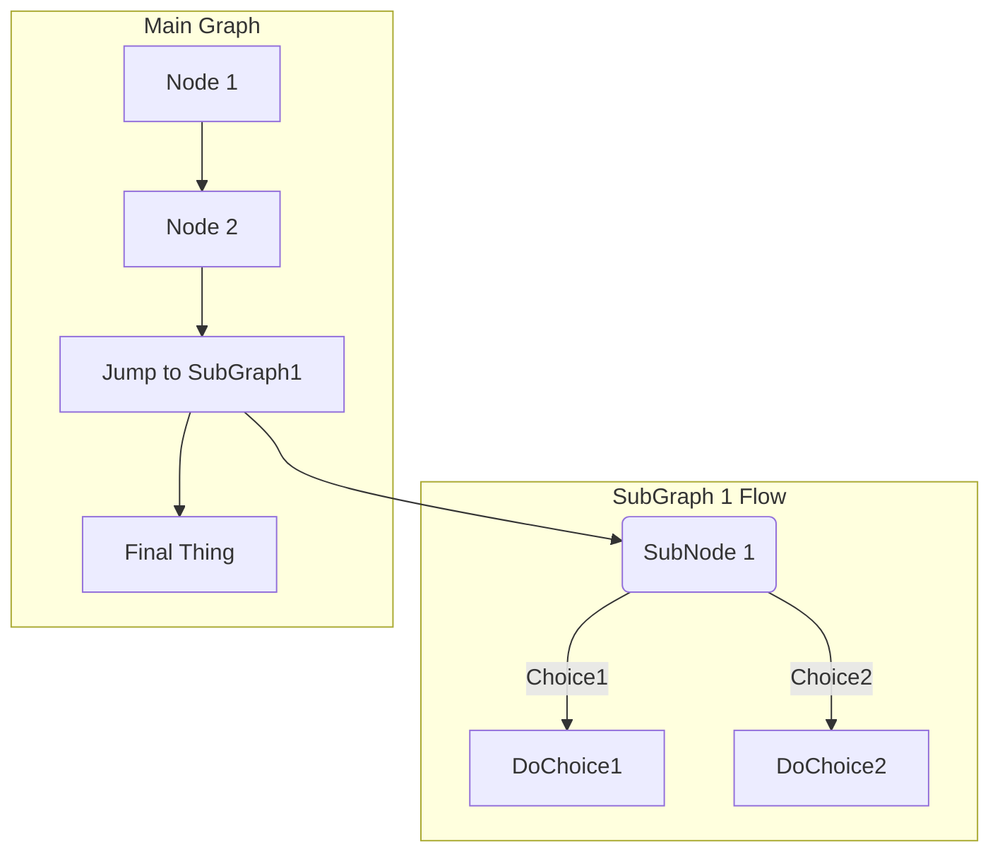

# Infos sur de projet Mdpol&Emploi

## User Guide

### installation des dépenddances 
`$ python -m pip install -r requirements.txt`
###  Premier lancement du projet
Si le repertoires  `data/cleanded` est vide alors assurez-vous de suprimer s'il existe, le fichier `data_already_downloaded.flag` avant le lancer le projet
### lancement du projet (`python>=3.0`)
`$ python main.py`

##  Data

`------fichier .csv -----`

- ### csv emploi 1996- 2023
    - [cliquez ici](https://public.opendatasoft.com/api/explore/v2.1/catalog/datasets/labouref-france-departement-quarter-jobseeker/exports/csv?lang=fr&timezone=Europe%2FBerlin&use_labels=true&delimiter=%3B)
- ### csv  geolocalisation
    - [cliquez ici](https://public.opendatasoft.com/api/explore/v2.1/catalog/datasets/correspondance-code-insee-code-postal/exports/csv?lang=fr&timezone=Europe%2FBerlin&use_labels=true&delimiter=%3B)
- ### csv emploi 2007-2012
    - [cliquez ici](https://public.opendatasoft.com/api/explore/v2.1/catalog/datasets/base-cc-caract-emploi-2012-arm/exports/csv?lang=fr&timezone=Europe%2FBerlin&use_labels=true&delimiter=%3B)
- ### csv  population
    - [cliquez ici](https://public.opendatasoft.com/api/explore/v2.1/catalog/datasets/demographyref-france-pop-legale-commune-arrondissement-municipal-millesime/exports/csv?lang=fr&timezone=Europe%2FBerlin&use_labels=true&delimiter=%3B)

`----- site  source ------`

### dataset geolocalisation départements 
[cliquez ici](https://public.opendatasoft.com/explore/dataset/correspondance-code-insee-code-postal/table/?location=3,18.5278,-2.98684&basemap=jawg.light)
    

### dataset emploi 2007-2012
[cliquez ici](https://public.opendatasoft.com/explore/dataset/base-cc-caract-emploi-2012-arm/information/?sort=actifs_occupes_15_ans_ou_plus_en_2007_princ&dataChart=eyJxdWVyaWVzIjpbeyJjb25maWciOnsiZGF0YXNldCI6ImJhc2UtY2MtY2FyYWN0LWVtcGxvaS0yMDEyLWFybSIsIm9wdGlvbnMiOnsic29ydCI6ImFjdGlmc19vY2N1cGVzXzE1X2Fuc19vdV9wbHVzX2VuXzIwMDdfcHJpbmMifX0sImNoYXJ0cyI6W3siYWxpZ25Nb250aCI6dHJ1ZSwidHlwZSI6ImNvbHVtbiIsImZ1bmMiOiJBVkciLCJ5QXhpcyI6ImNvZGVfZ2VvZ3JhcGhpcXVlIiwic2NpZW50aWZpY0Rpc3BsYXkiOnRydWUsImNvbG9yIjoiI0ZGNTE1QSJ9XSwieEF4aXMiOiJhbm5lZSIsIm1heHBvaW50cyI6NTAsInNvcnQiOiIifV0sInRpbWVzY2FsZSI6IiIsImRpc3BsYXlMZWdlbmQiOnRydWUsImFsaWduTW9udGgiOnRydWV9&location=3,18.54017,-3.01253&basemap=jawg.light)

### dataset emploi 1996- 2023
[cliquez ici](https://public.opendatasoft.com/explore/dataset/labouref-france-departement-quarter-jobseeker/export/?disjunctive.category&disjunctive.age_groups&disjunctive.reg_name&disjunctive.dep_area_code&disjunctive.dep_name&sort=date&refine.category=B&refine.category=C&dataChart=eyJxdWVyaWVzIjpbeyJjaGFydHMiOlt7InR5cGUiOiJjb2x1bW5yYW5nZSIsImZ1bmMiOiJDT1VOVCIsInlBeGlzIjoibmJfam9ic2Vla2VyIiwic2NpZW50aWZpY0Rpc3BsYXkiOnRydWUsImNvbG9yIjoicmFuZ2UtY3VzdG9tIiwiY2hhcnRzIjpbeyJmdW5jIjoiTUlOIiwieUF4aXMiOiJuYl9qb2JzZWVrZXIifSx7ImZ1bmMiOiJNQVgiLCJ5QXhpcyI6Im5iX2pvYnNlZWtlciJ9XX1dLCJ4QXhpcyI6ImRhdGUiLCJtYXhwb2ludHMiOiIiLCJ0aW1lc2NhbGUiOiJ5ZWFyIiwic29ydCI6IiIsInNlcmllc0JyZWFrZG93biI6ImNhdGVnb3J5IiwiY29uZmlnIjp7ImRhdGFzZXQiOiJsYWJvdXJlZi1mcmFuY2UtZGVwYXJ0ZW1lbnQtcXVhcnRlci1qb2JzZWVrZXIiLCJvcHRpb25zIjp7ImRpc2p1bmN0aXZlLmNhdGVnb3J5Ijp0cnVlLCJkaXNqdW5jdGl2ZS5hZ2VfZ3JvdXBzIjp0cnVlLCJkaXNqdW5jdGl2ZS5yZWdfbmFtZSI6dHJ1ZSwiZGlzanVuY3RpdmUuZGVwX2FyZWFfY29kZSI6dHJ1ZSwiZGlzanVuY3RpdmUuZGVwX25hbWUiOnRydWUsInNvcnQiOiJkYXRlIiwicmVmaW5lLmNhdGVnb3J5IjpbIkIiLCJDIl19fX1dLCJkaXNwbGF5TGVnZW5kIjp0cnVlLCJhbGlnbk1vbnRoIjp0cnVlLCJ0aW1lc2NhbGUiOiIifQ%3D%3D)  

### dataset relatives aux populations légales 2018- 2023
[cliquez ici](https://public.opendatasoft.com/explore/dataset/demographyref-france-pop-legale-commune-arrondissement-municipal-millesime/information/?disjunctive.reg_code&disjunctive.reg_name&disjunctive.dep_code&disjunctive.arrdep_code&disjunctive.com_arm_code&disjunctive.com_arm_name&disjunctive.epci_name&disjunctive.epci_code&disjunctive.dep_name&dataChart=eyJxdWVyaWVzIjpbeyJjb25maWciOnsiZGF0YXNldCI6ImRlbW9ncmFwaHlyZWYtZnJhbmNlLXBvcC1sZWdhbGUtY29tbXVuZS1hcnJvbmRpc3NlbWVudC1tdW5pY2lwYWwtbWlsbGVzaW1lIiwib3B0aW9ucyI6eyJkaXNqdW5jdGl2ZS5yZWdfY29kZSI6dHJ1ZSwiZGlzanVuY3RpdmUucmVnX25hbWUiOnRydWUsImRpc2p1bmN0aXZlLmRlcF9jb2RlIjp0cnVlLCJkaXNqdW5jdGl2ZS5hcnJkZXBfY29kZSI6dHJ1ZSwiZGlzanVuY3RpdmUuY29tX2FybV9jb2RlIjp0cnVlLCJkaXNqdW5jdGl2ZS5jb21fYXJtX25hbWUiOnRydWUsImRpc2p1bmN0aXZlLmVwY2lfbmFtZSI6dHJ1ZSwiZGlzanVuY3RpdmUuZXBjaV9jb2RlIjp0cnVlLCJkaXNqdW5jdGl2ZS5kZXBfbmFtZSI6dHJ1ZX19LCJjaGFydHMiOlt7ImFsaWduTW9udGgiOnRydWUsInR5cGUiOiJwaWUiLCJmdW5jIjoiQ09VTlQiLCJ5QXhpcyI6ImNvbV9hcm1fcG9wX211biIsInNjaWVudGlmaWNEaXNwbGF5Ijp0cnVlLCJjb2xvciI6InJhbmdlLWN1c3RvbSIsInBvc2l0aW9uIjoiY2VudGVyIn1dLCJ4QXhpcyI6Imdlb195ZWFyIiwibWF4cG9pbnRzIjoiIiwidGltZXNjYWxlIjoieWVhciIsInNvcnQiOiIiLCJzZXJpZXNCcmVha2Rvd24iOiIiLCJzZXJpZXNCcmVha2Rvd25UaW1lc2NhbGUiOiIifV0sImRpc3BsYXlMZWdlbmQiOnRydWUsImFsaWduTW9udGgiOnRydWV9)  

## Developer Guide
- l'ajout d'un graphe se fait dans le fichier `src/pages/graph.py` en rajoutant à la methode `graph_page()` le composant du graphe 
- Pour ajouter une page il faut rajouter le fichier .py   au  repertoire `src/pages` puis l'importé dans le `main.py` sans oublié de rajouter le chemin de routage  à la structure conditionnelle  écrite a ce effet. Le fichier `src/components/navbar.py permet d'ajouter la page dans une liste non ordonnée.

## Rapport d'analyse

`Emmanuel Macron`
En cinq ans le chômage est passé de 9,5% de la population active à 7,4%, avec un mandat toujours encours

`Nicolas Sarkozy`
Confronté à la crise des subprimes, le mandat de Nicolas Sarkozy a vu le chômage passer de 8,1 à 9,5% de la population active

`François Hollande`
Le mandat François Hollande n'aura pas donné lieu à une baisse spectaculaire

`Jacques Chirac`
La France connaît au début du quinquennat Chirac un taux de chômage supérieur à 10%. La baisse entamée en 1998 se poursuit durant la cohabitation et passe sous la barre des 8% en 2001

On observe d'après le diagramme en anneaux que la taux de chomeurs n'est pas proportionnel  à la densité de la population 
Il y a donc une disparité disproportionnelle dans la repartion des offres d'emploi.

## Copyright 
 c Nous déclarons sur l’honneur que le code fourni a été produit par nous, master et contributeurs du depôt git ci contre 
https://github.com/Magloire07/Projet_python_dataViz_Kokou_Ounissa.git
.

